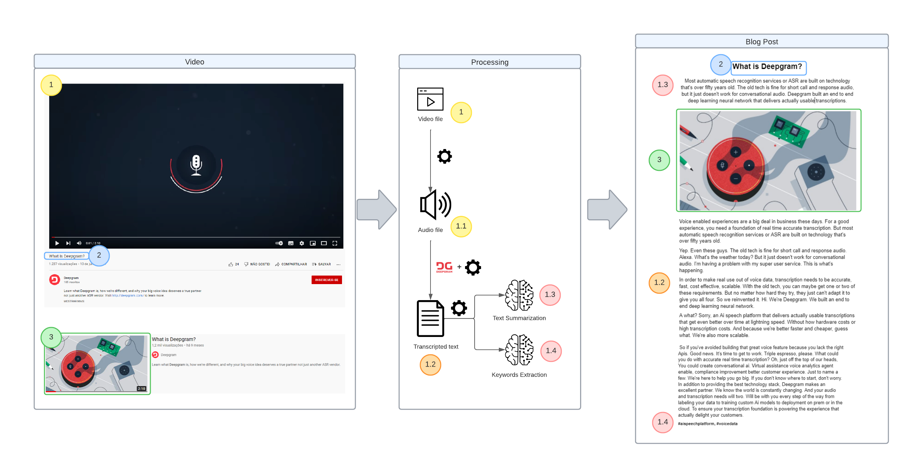

# Automatic Blog Post
<a href="https://www.python.org/"></a>

Automatic blog post is a Python project created to generate automatically blog posts from videos.



The final blog post consists of 5 main components: **title, summary, image, text** and **keywords**. The image above represents how this architecture works. As you can see, this is a machine learning project with natural language processing.

First, we need to process the video to extract the audio. Using the DeepGram API we can do the speech to text. Later, we split the text into paragraphs. For that, we are analyzing the pause between the words to find if the sentences belong to the same paragraph or if it’s a new one.

Then, we use some pre-trained machine learning models to create the text keywords and summary. We also get the video thumbnail and name, which will be our blog post image and title, respectively.

## How can I use it?

The first step is to create a [DeepGram account](https://console.deepgram.com/signup). After that, you can generate an API key. On [this page](https://console.deepgram.com/project/), just click on the button **Create a New API Key**. You'll have to choose a name for the key, set permission and set the expiration date.

After you click **Create Key** button, a new key will be created and it's important that you keep it safe.

To run the code, you’ll need Python installed.
I also recommend that you create a new environment specifically for this project. My suggestion is to use [Anaconda](https://www.anaconda.com/).

```console
conda create -n automatic-blog-post
```

```console
conda activate automatic-blog-post
```

```console
conda install pip
```

```console
pip install --upgrade
```

To install the Python packages, just run the following command:

```console
pip install -r requirements.txt
```

Then, simply run the following command. The parameter <youtube_url> is simply the full url of the video, for example: https://www.youtube.com/watch?v=kibx5BR6trA&ab_channel=Deepgram .

```console
python generate_blog_post.py --deepgram <api_key> --video <youtube_url>
```

_Note: This is a demonstration tutorial, if you plan to use this in production, I recommend that you use a Key Vault to store the DeepGram API Key._

After a couple of minutes, you'll see the blog post markdown file in your output directory!

## How does it work?

The code:

1. Downloads the audio from the specified video URL
2. Downloads the image from the thumbnail
3. Crops the black border of the image
4. Saves the processed image
5. Generates the text from the audio using DeepGram API
6. Process the text to fix the punctuation
7. Splits the text into new paragraphs using the median pause between words and the punctuation as a heuristic
8. Stores the text
9. Gets keywords from the text using KeyBERT
10. Gets summary using pretrained [Hugging Face DistilBART](https://huggingface.co/sshleifer/distilbart-cnn-12-6)
11. Creates a markdown template
12. Fill the markdown template with title, image, summary, keywords and text
13. Saves the markdown in the output directory

## Post-processing

If you need some text post-processing, you can use the edit_blog_post module. This can be useful if your video has some very rare words. For example, the abbreviation "ASR" (automatic speech recognition) was captured as "As r". So, in the process_dictionary.json file which you will need to put your key-value pair "As r": "ASR".
The process_dictionary.json looks like this:

`{ 
    "As r": "ASR",
    "Ai": "AI",
    "Apis": "APIs"
}`

Then, you can use the following command to automatically replace those words. Don't worry, because it will reuse the previous processing. So, it will not download the audio or try to transcript it again.

```console
python edit_blog_post.py --video <youtube_url>
```
    
Well, now your post is ready and saved in the same path! 

## Result
You can check the result blog post example here: https://github.com/tiemi/automatic-blog-post/blob/main/output/WhatisDeepgram.md

## License
[Apache-2 license](https://www.apache.org/licenses/LICENSE-2.0)